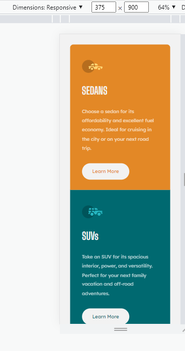

# Frontend Mentor - 3-column preview card component solution

This is a solution to the [3-column preview card component challenge on Frontend Mentor](https://www.frontendmentor.io/challenges/3column-preview-card-component-pH92eAR2-). Frontend Mentor challenges help you improve your coding skills by building realistic projects.

## Table of contents

- [Overview](#overview)
  - [The challenge](#the-challenge)
  - [Screenshot](#screenshot)
  - [Links](#links)
- [My process](#my-process)
  - [Built with](#built-with)
  - [What I learned](#what-i-learned)
  - [Continued development](#continued-development)
- [Author](#author)

## Overview

### The challenge

Mobile and desktop view except screens above 1440px covered.

### Screenshot

### Links

- Solution URL: [Frontend Mentor](https://frontendmentor.io)
- Live Site URL: [Live site](https://cardscomponent.vercel.app)

## My process

Started the design using a mobile-first approach. Used the media queries to optimize for some desktops, tablets and mobile screens.

### Built with

- Semantic HTML5 markup
- CSS custom properties
- Flexbox
- CSS Grid
- Desktop-first workflow

### What I learned

Practiced on writing a clean code, though I feel I have a lot to learn concerning media queries.

### Continued development

More optimization for some screens ignored in the desktop space and also for the iPad Pro.

## Author

- Frontend Mentor - [@meistens](https://www.frontendmentor.io/profile/meistens)
- Twitter - [@ItzkrazyDave](https://www.twitter.com/ItzkrazyDave)
