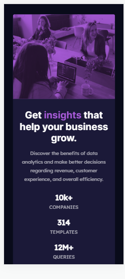

# Frontend Mentor - Stats preview card component solution

This is a solution to the [Stats preview card component challenge on Frontend Mentor](https://www.frontendmentor.io/challenges/stats-preview-card-component-8JqbgoU62). Frontend Mentor challenges help you improve your coding skills by building realistic projects.

## Table of contents

- [Overview](#overview)
  - [The challenge](#the-challenge)
  - [Screenshot](#screenshot)
  - [Links](#links)
- [My process](#my-process)
  - [Built with](#built-with)
  - [What I learned](#what-i-learned)
  - [Continued development](#continued-development)
  - [Useful resources](#useful-resources)
- [Author](#author)
- [Acknowledgments](#acknowledgments)

## Overview

Created a responsive component page using Grid and FlexBox.

### The challenge

- Optimized for mobile screens with a width of 414px below;

- Optimized for screens of 1440px;

### Screenshot




### Links

- Solution URL: [Add solution URL here](https://github.com/meistens/Basic-Component-Page-2/tree/master/stats-preview-card-component-main)
- Live Site URL: [Add live site URL here](https://basic-component-page-2.vercel.app)

## My process

Started out by sketching the design on paper, then coding the design.

Built using a desktop-first approach, before moving on to style for mobile.

### Built with

- Semantic HTML5 markup
- CSS custom properties
- Flexbox
- CSS Grid
- Desktop-first workflow

### What I learned

Learnt about this cool feature called blend mode, which iI used to overlay the image.

Goes thus

```CSS
mix-blend-mode: multiply;
```

But in all honesty, got that idea from checking out [DarrickFauvel](https://www.github.com/DarrickFauvel/fem07-stats-preview-card-component) repo after checking the slack channel for ideas.

### Continued development

When I am comfortable with using TailwindCSS, I will revisit this challenge (and others too).

Plus, the image might be a bit off from the design, which is something I will work on behind the scenes.

### Useful resources

- [Example resource 1](https://www.example.com) - This helped me for XYZ reason. I really liked this pattern and will use it going forward.
- [Example resource 2](https://www.example.com) - This is an amazing article which helped me finally understand XYZ. I'd recommend it to anyone still learning this concept.

**Note: Delete this note and replace the list above with resources that helped you during the challenge. These could come in handy for anyone viewing your solution or for yourself when you look back on this project in the future.**

## Author

- Website - [Add your name here](https://www.your-site.com)
- Frontend Mentor - [@yourusername](https://www.frontendmentor.io/profile/yourusername)
- Twitter - [@yourusername](https://www.twitter.com/yourusername)

**Note: Delete this note and add/remove/edit lines above based on what links you'd like to share.**

## Acknowledgments

Thanks to [DarrickFauvel](https://www.github.com/DarrickFauvel/fem07-stats-preview-card-component), whose solution on how to apply the background helped.
